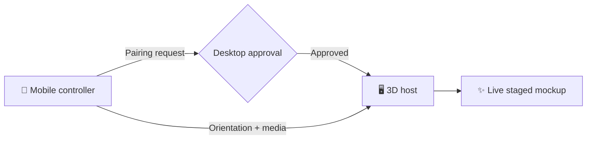

# OMGMimiq

### Motion-synced 3D phone staging, controlled from your pocket.
<p>
	<a href="https://omgmimiq.netlify.app/"></a>
	<a href="https://github.com/hasibul2hasan/omgmimiq"></a>


</div>
> **Try it now:** [Open the published Netlify app](https://omgmimiq.netlify.app/), scan the pairing QR code with a phone, approve the connection, and enable motion tracking.

## ✦ What It Does
OMGMimiq turns a desktop browser into a live 3D smartphone studio. A physical phone supplies orientation data through the browser's `DeviceOrientation` API, while PeerJS/WebRTC carries motion and media data between the two devices.


## ✨ Highlights

| | Capability | What you can do |
|---|---|---|
| 🧭 | **Motion control** | Tilt a phone to rotate the desktop 3D model in real time. |
| 🔗 | **Quick pairing** | Connect with a four-character room code or QR code. |
| 🛡️ | **Host approval** | Accept or decline every mobile controller connection. |
| 🖼️ | **Screen sources** | Use the dynamic clock, a custom screenshot, or a demo video. |
| 📡 | **Live media** | Share the phone screen or camera, with front/rear switching. |
| 🎛️ | **Fine tuning** | Adjust sensitivity, damping, axis inversion, and calibration. |
| 🎨 | **Studio styling** | Change titanium finishes, themes, and background presets. |
| ▶️ | **Video controls** | Play, pause, seek, mute, rewind, forward, and restart. |
## 🚀 Published App

| Experience | URL |
|---|---|
| 🖥️ Desktop host | [omgmimiq.netlify.app](https://omgmimiq.netlify.app/) |
| 📱 Mobile controller | [omgmimiq.netlify.app/phone](https://omgmimiq.netlify.app/phone) |
The controller also supports room codes in these formats:

`/phone/:code` · `/pair/:code` · `/remote/:code` · `/join/:code` · `/phone?room=:code`
## 📲 Pair a Device

1. Open the [desktop host](https://omgmimiq.netlify.app/) on your computer.
2. Scan the displayed QR code, or open the mobile controller on your phone.
3. Enter the four-character code if it was not included in the URL.
4. Tap **Pair**, then approve the request on the desktop.
5. Tap **Enable Motion** and tilt the phone.

> **iPhone and iPad:** motion and camera APIs generally require HTTPS. Use the Netlify deployment when testing on iOS and allow the requested browser permissions.
## 🧰 Run Locally

```bash
npm install
```

For a regular start without file watching:
```bash
npm start
```
For phone testing over local Wi-Fi, open the host using your computer's network IP and use its generated QR code. iOS may require an HTTPS tunnel such as ngrok or localtunnel.

<details>
<summary>🔒 HTTPS tunnel example</summary>

```bash
npm start
```

Open the generated HTTPS address on the desktop, then scan its pairing QR code with the phone.
</details>
## 🗂️ Project Map

```text
.
├── public/
│   ├── index.html    # Desktop 3D host and staging controls
│   ├── phone.html    # Mobile pairing and controller interface
│   ├── style.css     # Shared host and controller styles
│   ├── images/       # Image assets
│   └── models/       # 3D model assets
├── server.js         # Local Express server and WebSocket support
├── netlify.toml      # Static publish settings and controller redirects
└── package.json      # Scripts and dependencies
```
## ⚙️ How Deployment Works

Netlify publishes `public/` as a static site. The redirects in `netlify.toml` map `/phone`, `/pair`, `/remote`, and `/join` to the mobile controller page.

The local `server.js` provides static hosting, local network configuration, and WebSocket support for development. The deployed frontend uses PeerJS's cloud signaling service for browser-to-browser WebRTC pairing.
## 🧪 Built With

<p>
	
	
	
	
	
	
	
</p>
# OMGMimiq

OMGMimiq is an interactive 3D smartphone mockup controlled by a physical mobile device. Open the host view on a desktop, pair a phone with the displayed four-character code, and tilt the phone to control the 3D model in real time.

## Published App

The current Netlify deployment is available at:

**https://omgmimiq.netlify.app**

Host view: `https://omgmimiq.netlify.app/`

Mobile controller: `https://omgmimiq.netlify.app/phone`

## Features

- Real-time phone orientation control using the browser `DeviceOrientation` API.
- Peer-to-peer communication through PeerJS/WebRTC, with no application database or login.
- Host approval flow before a mobile controller can send data.
- QR code and four-character room code pairing.
- Dynamic clock screen for the 3D phone.
- Custom screenshot and demo video textures.
- Mobile screen sharing and camera sharing, including front/rear camera switching.
- Video playback controls for play, pause, seeking, mute, rewind, forward, and restart.
- Motion sensitivity, damping, axis inversion, and recalibration controls.
- Titanium finish options and studio background presets.
- Desktop orbit controls and camera reset.

## How Pairing Works

1. Open the host view on a desktop: `https://omgmimiq.netlify.app/`.
2. Note the four-character pairing code and scan the QR code, or open the mobile controller URL on your phone.
3. Enter the code on the phone if it was not included in the URL.
4. Select **Pair** and approve the connection from the desktop host.
5. Enable motion tracking on the phone and tilt the device.

The controller also accepts these URL formats:

- `/phone/:code`
- `/pair/:code`
- `/remote/:code`
- `/join/:code`
- `/phone?room=:code`

## Browser Requirements

Motion sensors require a secure context in many browsers, especially iOS Safari. Use the HTTPS Netlify deployment when testing on an iPhone or iPad. The browser may also ask for motion and camera permissions before those features can be used.

## Run Locally

Install dependencies:

```bash
npm install
```

Start the development server with automatic restart:

```bash
npm run dev
```

Or start it directly:

```bash
npm start
```

The server runs on `http://localhost:3000` by default. If that port is occupied, it automatically tries the next available port. Set `PORT` to choose a specific port:

```bash
PORT=4000 npm start
```

For local phone testing, open the host on the computer's local network address, then use the generated QR code or open `/phone.html?room=XXXX` from a phone on the same Wi-Fi network. iOS sensor access may require an HTTPS tunnel such as ngrok or localtunnel.

## Project Structure

```text
.
├── public/
│   ├── index.html    # Desktop 3D host and staging controls
│   ├── phone.html    # Mobile pairing and controller interface
│   ├── style.css     # Shared host and controller styles
│   ├── images/       # Image assets
│   └── models/       # 3D model assets
├── server.js         # Local Express server and WebSocket support
├── netlify.toml      # Netlify publish directory and controller redirects
└── package.json      # Scripts and dependencies
```

## Deployment

Netlify publishes the `public` directory as a static site. The redirects in `netlify.toml` keep the controller routes available at `/phone`, `/pair`, `/remote`, and `/join`.

The local `server.js` provides static hosting, local network configuration, and WebSocket support for local development. The deployed frontend uses PeerJS's cloud signaling service for browser-to-browser WebRTC pairing.

## Technology

- HTML, CSS, and browser JavaScript
- Three.js for the 3D smartphone scene and controls
- PeerJS/WebRTC for pairing and real-time data and media transfer
- Express and `ws` for the local development server
- Netlify for static hosting
