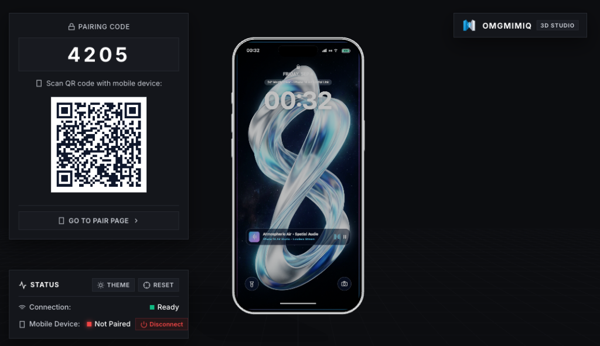

# OMGMimiq

<div align="center">

### Motion-synced 3D smartphone staging, controlled directly from your pocket.

<p align="center">
  
</p>

[](https://omgmimiq.netlify.app/)
[](https://github.com/hasibul2hasan/omgmimiq)
[](LICENSE)
[](https://threejs.org/)
[](https://peerjs.com/)
[](https://nodejs.org/)
[](https://github.com/websockets/ws)
[](https://omgmimiq.netlify.app/)

</div>

---

## ✨ Features

- 🧭 **Real-Time Motion Tracking** — Mirrors phone tilt, pitch, roll, and yaw at 60 FPS using the browser's native `DeviceOrientation` API with zero mobile app installation required.
- ⚡ **Peer-to-Peer WebRTC Sync** — Delivers ultra-low-latency communication via **PeerJS** directly between browsers with no intermediary database storage.
- 🔒 **Host Approval & Secure Pairing** — Generates unique four-character room codes and dynamic QR codes with a desktop authorization prompt to protect active sessions.
- 📡 **Live Media Streaming** — Streams your mobile device's camera (with front/rear lens switching) or phone screen directly onto the 3D phone model.
- 🖼️ **Versatile Screen Textures** — Switch dynamically between an active digital clock, custom image uploads, or looped video showcases.
- 🎛️ **Precision Calibration Controls** — Fine-tune rotation sensitivity, apply motion damping, invert individual axes, and re-center calibration in one click.
- 🎨 **Photorealistic Studio Mockups** — Features detailed smartphone geometry with authentic titanium finishes (Natural, Black, White, Desert) and customizable lighting rigs.
- ▶️ **Integrated Video Playback Deck** — Complete control over video textures with play, pause, progress scrubbing, audio mute, and rewind capabilities.

---

## 📸 Demo & Screenshots

<p align="center">
  
</p>

---

## 🚀 Getting Started

Follow these steps to set up and run OMGMimiq locally on your machine.

### 1. Prerequisites

Ensure you have the following installed:
- **Node.js** (v16.0.0 or higher)
- **npm** (v7.0.0 or higher)
- A modern web browser supporting **WebGL** and **WebRTC** (Chrome, Safari, Firefox, Edge)

### 2. Installation

Clone the repository and install project dependencies:

```bash
# Clone the repository
git clone https://github.com/hasibul2hasan/omgmimiq.git

# Navigate into the project root
cd omgmimiq

# Install dependencies
npm install
```

### 3. Local Deployment

Start the development server:

```bash
# Run with live reload via nodemon
npm run dev

# Or run standard production start
npm start
```

By default, the server runs on `http://localhost:3000`. If port 3000 is occupied, it automatically increments to the next free port.

```text
=================================================
  OMGMimiq Server running on:
  - Local:   http://localhost:3000
  - Network: http://192.168.1.100:3000
=================================================
```

> 📱 **Testing on Mobile (iOS / Android):**
> - Connect your smartphone to the same Wi-Fi network as your computer.
> - Open `http://<YOUR_LOCAL_IP>:3000` on your desktop and scan the QR code with your phone.
> - **iOS Safari Note:** iOS strictly requires HTTPS to grant access to the `DeviceOrientation` and camera APIs. When developing locally for iOS, use an HTTPS tunnel such as [ngrok](https://ngrok.com/) (`npx ngrok http 3000`) or test directly via the [Netlify Deployment](https://omgmimiq.netlify.app/).

---

## 💡 Usage

### Pairing Devices

1. **Launch Host View:** Open the desktop host at `http://localhost:3000` (or the deployed Netlify URL).
2. **Scan or Enter Code:** Scan the on-screen QR code with your mobile camera, or navigate to `/phone` and enter the 4-character room code.
3. **Approve Request:** Click **Approve** on the desktop notification banner to accept the incoming controller connection.
4. **Enable Sensors:** Tap **Enable Motion** on your mobile controller, calibrate the angle, and tilt your device to manipulate the 3D phone model.

### Clean Pairing Route Aliases

OMGMimiq supports convenient clean URLs for direct mobile pairing:

```http
GET /phone/:code
GET /pair/:code
GET /remote/:code
GET /join/:code
GET /phone?room=:code
```

### WebSocket Motion Protocol

When using the built-in local WebSocket relay, orientation payloads follow this schema:

```json
{
  "type": "orientation",
  "alpha": 182.45,
  "beta": 14.20,
  "gamma": -3.85
}
```

---

## ⚙️ Configuration

### Environment Variables

Configure the server runtime by setting the following environment variables:

| Variable | Type | Default | Description |
| :--- | :--- | :--- | :--- |
| `PORT` | `Number` | `3000` | Target port number for the Express HTTP and WebSocket server. |
| `NODE_ENV` | `String` | `development` | Server runtime environment (`development` or `production`). |

### Route & Architecture Map

| Route / Path | Target File | Description |
| :--- | :--- | :--- |
| `/` | `public/index.html` | Desktop 3D staging studio and Three.js canvas viewport. |
| `/phone` | `public/phone.html` | Mobile sensor interface, camera streamer, and control pad. |
| `/api/config` | `server.js` | Returns local network IP and active listening port as JSON. |
| `/models/*` | `public/models/` | 3D geometry assets (`.glb`, `.fbx`, `.gltf`). |
| `netlify.toml` | — | Netlify deployment redirects and single-page routing rules. |

---

## 🤝 Contributing

Contributions make the open-source community an incredible place to learn, inspire, and create. Any contributions you make are **greatly appreciated**.

1. **Fork** the project repository.
2. **Create** your feature branch:
   ```bash
   git checkout -b feature/AmazingFeature
   ```
3. **Commit** your changes with clear messages:
   ```bash
   git commit -m "Add AmazingFeature"
   ```
4. **Push** to the branch:
   ```bash
   git push origin feature/AmazingFeature
   ```
5. **Open** a Pull Request for review.

Found a bug or have a suggestion? Feel free to open an issue in the [GitHub Issues](https://github.com/hasibul2hasan/omgmimiq/issues) tracker.

---

## 📄 License

Distributed under the **MIT License**. See the `LICENSE` file for more details.
